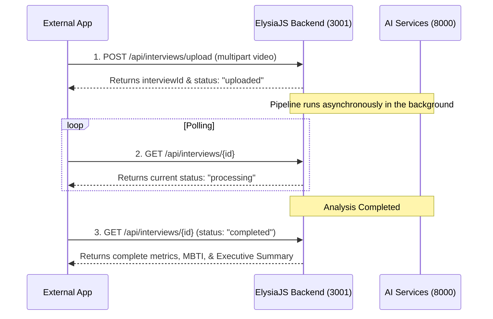

# 🔌 Interview Analyzer — API Integration Guide (Option A)

This document provides instructions on how to integrate the Multimodal Interview Analyzer into external applications using the asynchronous (Option A) polling flow.

---

## API Base URL
```
http://localhost:3001
```

---

## Integration Workflow

The API uses an asynchronous processing model. Because processing video and audio takes time, developers should follow this three-step workflow:
1. **Upload**: Send the video to start the analysis (returns a unique `interviewId`).
2. **Poll**: Query the status endpoint using the `interviewId` until the status is `"completed"`.
3. **Retrieve**: Get the full analysis summary, MBTI type, and Gemini-generated executive summary.



---

## API Endpoints

### 1. Start Analysis (Upload Video)
Initiates the pipeline for a candidate.

* **Endpoint**: `/api/interviews/upload`
* **Method**: `POST`
* **Content-Type**: `multipart/form-data`
* **Form Parameters**:
  * `candidateName` (string, required): Full name of the candidate.
  * `candidateType` (string, required): Kategori rekrutmen. Allowed values: `intern` or `employee`.
  * `video` (file, required): The video file (supported formats: `.mp4`, `.webm`).

#### Example Request (cURL):
```bash
curl -X POST http://localhost:3001/api/interviews/upload \
  -F "candidateName=John Doe" \
  -F "candidateType=employee" \
  -F "video=@/path/to/interview.mp4"
```

#### Example Response:
```json
{
  "message": "Video uploaded and analysis started successfully",
  "interviewId": "a82df6d4-8390-4822-bfb2-031e4e13cd77",
  "status": "uploaded"
}
```

---

### 2. Check Status & Retrieve Results
Queries the status of an analysis and retrieves the results upon completion.

* **Endpoint**: `/api/interviews/{id}`
* **Method**: `GET`
* **URL Parameter**:
  * `id` (UUID, required): The `interviewId` returned in step 1.

#### Example Request (cURL):
```bash
curl http://localhost:3001/api/interviews/a82df6d4-8390-4822-bfb2-031e4e13cd77
```

#### Response (while processing):
```json
{
  "id": "a82df6d4-8390-4822-bfb2-031e4e13cd77",
  "candidateName": "John Doe",
  "candidateType": "employee",
  "status": "processing",
  "summary": null,
  "mbti": null
}
```

#### Response (on success):
```json
{
  "id": "a82df6d4-8390-4822-bfb2-031e4e13cd77",
  "candidateName": "John Doe",
  "candidateType": "employee",
  "status": "completed",
  "durationSeconds": 120,
  "summary": {
    "dominantEmotion": "neutral",
    "emotionStabilityScore": 85.5,
    "avgPitchHz": 124.8,
    "speakingRateWpm": 130,
    "fillerCount": 4,
    "fillerPercentage": 3.1,
    "overallScore": 82.5,
    "executiveSummary": "Kandidat menunjukkan profil komunikasi yang terstruktur dengan tempo bicara ideal..."
  },
  "mbti": {
    "predictedType": "INTJ",
    "confidence": 0.88,
    "reasoning": {
      "E_I": "Kandidat tergolong Introversion...",
      "S_N": "Kandidat cenderung Intuition...",
      "T_F": "Kandidat dinilai lebih Thinking...",
      "J_P": "Kandidat didominasi Judging..."
    }
  }
}
```

#### Response (on failure):
```json
{
  "id": "a82df6d4-8390-4822-bfb2-031e4e13cd77",
  "candidateName": "John Doe",
  "candidateType": "employee",
  "status": "failed",
  "summary": null,
  "mbti": null
}
```

---

## Timeline Datasets (Optional)
If the external application needs to render fine-grained timelines or interactive charts, they can query these endpoints directly:

* **Expressions Logs**: `GET /api/interviews/{id}/expressions` (FER emosi frame-by-frame)
* **Voice Pitch Logs**: `GET /api/interviews/{id}/voice` (data Pitch/Intensitas per detik)
* **Transcript Logs**: `GET /api/interviews/{id}/transcript` (transkrip teks dengan penanda filler words per segmen)
